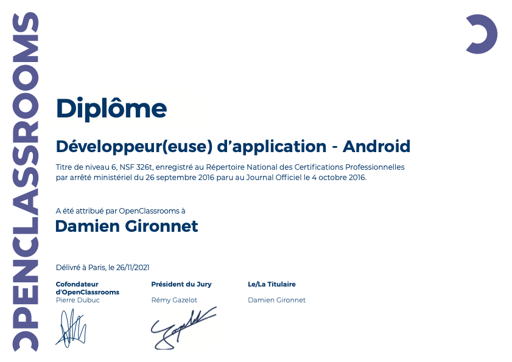

<ul style="list-style: none;">

<h1>Formation Développeur d'applications Android</h1>
<h4>Le Chesnay-Rocquencourt, Île-de-France, à distance 
févr. 2020 - déc. 2021</h4>

</ul>

   

 

La formation contient plusieurs projets soit d'applications, soit de documentations fonctionnelles et techniques.

Les projets d'applications ont eu pour objectif l'apprentissage du SDK Android, soit en Java ou en Kotlin, de rédiger des tests unitaires et instrumentées et de s'assurer de la couverture de tests, de persister des données locales dans une base de données interne à l'appareil ou créer des préférences partagés, à utiliser la Google Play  Console, à apprendre à utiliser Firebase Authentication, Storage, Firestore et Functions, utiliser les Intents, créer des applications selon les tailles d'écran, dans différentes langues, utiliser RxJava et observer l'état de la connexion de l'appareil.

Les projets de documentations fonctionnelles et techniques ont eu pour objectif d'apprendre à créer des diagrammes de type UML comme des diagrammes de classe, de contexte, d'interaction globale, de séquences, d'activité, de cas d'utilisation et d'état machine.

 

